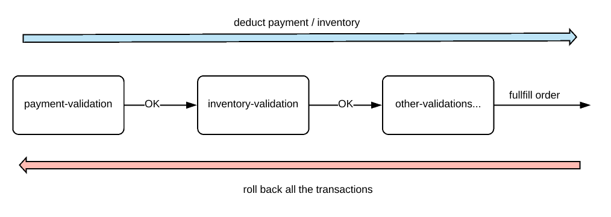

# Orchestration Saga Pattern With Spring Boot

I would like to show you a simple implementation of Orchestration Saga Pattern with Spring Boot.

Over the years, Microservices have become very popular. Microservices are distributed systems. They are smaller, modular, easy to deploy and scale etc. Developing a single Microservice application might be interesting! But handling a business transaction which spans across multiple Microservices is not fun!  In order to complete an application workflow / a task, multiple Microservices might have to work together.

Let’s see how difficult it could be in dealing with transactions / data consistency in the distributed systems in this article & how Orchestration Saga Pattern could help us.

## A Simple Transaction:

Let’s assume that our business rule says, when a user places an order, order will be fulfilled if the product’s price is within the user’s credit limit/balance & the inventory is available for the product. Otherwise it will not be fulfilled. It looks really simple. This is very easy to implement in a monolith application. The entire workflow can be considered as 1 single transaction. It is easy to commit / rollback when everything is in a single DB. With distributed systems with multiple databases, It is going to be very complex! Let’s look at our architecture first to see how to implement this.

We have below Microservices with its own DB.

- order-service
- payment-service
- inventory-service

When the order-service receives the request for the new order, It has to check with the payment-service & inventory-service. We deduct the payment, inventory and fulfill the order finally! What will happen if we deducted payment but if inventory is not available? How to roll back? It is difficult when multiple databases are involved.

## Saga Pattern:

Each business transaction which spans multiple microservices are split into micro-service specific local transactions and they are executed in a sequence to complete the business workflow. It is called Saga. It can be implemented in 2 ways.

- Choreography approach
- Orchestration approach

## Orchestration Saga Pattern:

In this pattern, we will have an orchestrator, a separate service, which will be coordinating all the transactions among all the Microservices. If things are fine, it makes the order-request as complete, otherwise marks that as cancelled.

Let’s see how we could implement this. Our sample architecture will be more or less like this.!

- In this demo, communication between orchestrator and other services would be a simple HTTP in a non-blocking asynchronous way to make this stateless.
- We can also use Kafka topics for this communication. For that we have to use **scatter/gather pattern** which is more of a stateful style.

## Technologies Stack

- Java SDK 17
- Spring Boot Framework
- Spring Jdbc API
- RabbitMQ
- Docker

## Licences

